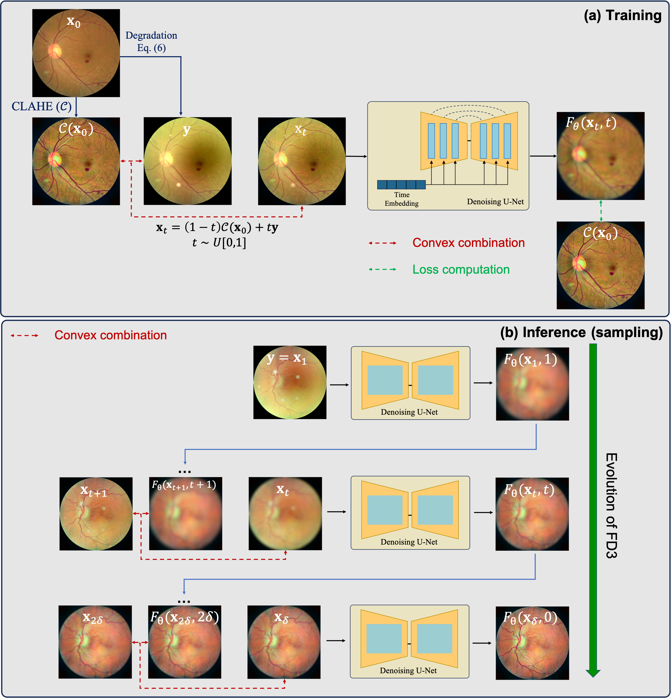

# Fundus image enhancement through direct diffusion model


(a) Training of FD3 (b) Inference (sampling) of FD3


final result of in-vivo data

## Abstract
We propose FD3, a fundus image enhancement method based on direct diffusion model, which can cope with a wide range of complex degradations, including haze, blur, noise, and shadow.
We first propose a synthetic forward model through a human feedback loop with board-certified ophthalmologists for maximal quality improvement of low-quality in-vivo images.
Using the proposed forward model, we train a robust and flexible diffusion-based image enhancement network that is highly effective as a stand-alone method, unlike previous diffusion model-based approaches which act only as a refiner on top of pre-trained models.
Through extensive experiments, we show that FD3 establishes the new state-of-the-art not only on synthetic degradations but also on in vivo studies with low-quality fundus photos taken from patients with cataracts or small pupils.

## Prerequisites
- python 3.7.16
- torch 1.11.0

## Data
[EyeQ dataset](https://github.com/HzFu/EyeQ)
- chose only the fundus photos under "Good" category
- data number
    - train : 14717
    - validation : 1000
    - test : 1000
- For the hazy image, we applied light transmission disturbance, image blurring, and retinal artifacts
- For the ground-truth, we enhanced it using CLAHE(Contrast Limited Adaptive Histogram Equalization)

[FPE dataset](https://drive.google.com/file/d/156TQtOpPEe5RXFF6PmdO9emyYFdpeiLU/view?usp=sharing)
We additionally publish data of fundus photos collected from the Kangnam Sacred Heart Hospital, Hallym University School of Medicine, Seoul, South Korea (IRB approval number: 2022-10-026), which contains the following three directories
- good: 1152 high-quality images of varying resolution
- bad:
    - cataract: 40 hazy images stemming from the bad eye condition
    - general: 10 low quality images due to arbitrary reasons
- before_after_surgery:
    - two subfolders containing fundus photos before and after cataract surgery

## Getting started

### 1) Clone the repository

### 2) Download pretrained checkpoint
- Download the checkpoint from the [link](https://drive.google.com/drive/folders/1FRyg3ZY0tF7nHjTRKZ0ciGsC9A4xMm2F?usp=sharing)
- paste it to ./workdir/

```
    mkdir workdir
    mv {DOWNLOAD_DIR}/ema_0.9999_0000.pt ./workdir/
    mv {DOWNLOAD_DIR}/model_0000.pt ./workdir/
```

### 3) Data structure
- 'real' is the directory of in-vivo data (Since there is no ground truth (GT) data available for in-vivo conditions, you should duplicate the existing in-vivo directory and label these duplicates as 'hazy' and 'img_clahe', respectively.)
```
data:
    root
        ./train/
            hazy
            img_clahe
        ./valid/
            hazy
            img_clahe
        ./test/
            hazy
            img_clahe
        ./real/
            hazy
            img_clahe
```

### 4) Train
```
train.sh
```

### 5) Inference
```
infer.sh
```
